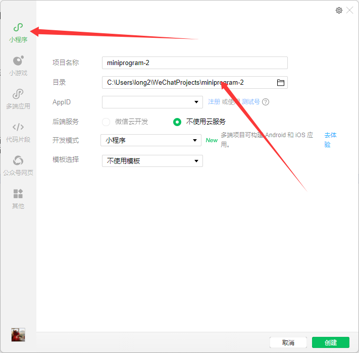

项目简介
=========

这是一个微信小程序项目（旅游微信小程序-前端）。

- 功能：浏览和发布旅行/拼团信息、消息、用户中心等。
- 框架/依赖：使用 Vant Weapp 组件库和小程序原生开发（详情见 package.json）。

快速开始
---------

1. 在微信开发者工具中打开本项目目录。
2. 如需安装 Node 依赖（仅用于构建/工具），运行：

```
npm install
```

3. 使用微信开发者工具进行预览与真机调试。
   将该文件夹作为项目路径 如图:

